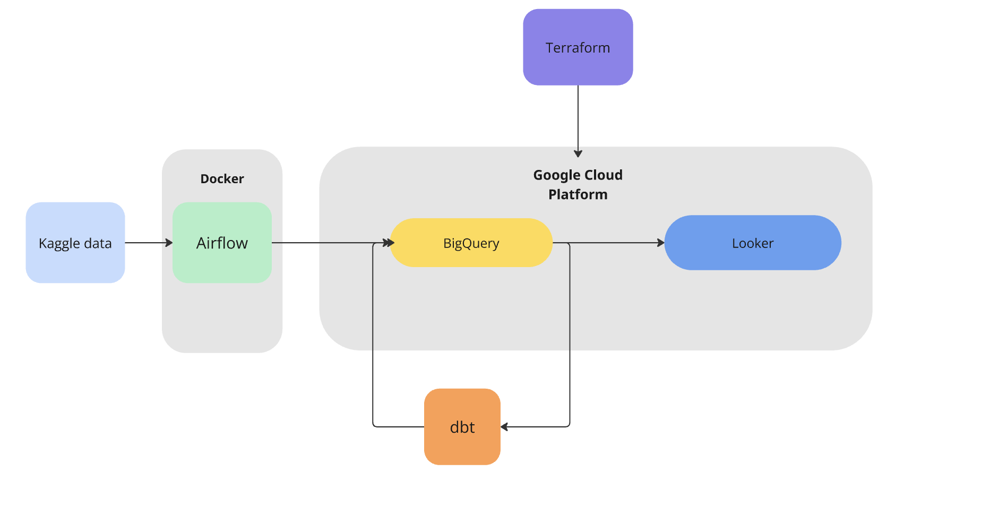
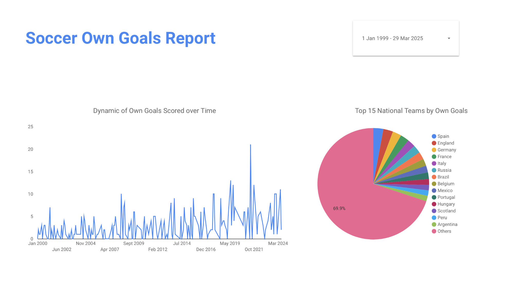

# Soccer Games Analytics Pipeline

## Problem Statement

This project implements an end-to-end data pipeline for **analyzing international football match data**. Built on a modern data stack, it automates data ingestion, transformation, and analysis using Airflow, BigQuery, and dbt, with infrastructure managed through Terraform.

The data source used is from Kaggle [International football results from 1872 to 2017](https://www.kaggle.com/datasets/martj42/international-football-results-from-1872-to-2017). The main goal of the project is to analyze the **dynamics of own goals** scored by various teams from 1872 to 2017.

## Architecture


#### Technology Stack

- **Workflow Orchestration** with **Docker**
- **Data Orchestration** using **Airflow**
- **Scalable Data Warehousing** with **BigQuery**
- **Interactive Data Visualization** using **Looker**
- **Data Transformation** with **data build tool**
- **Infrastructure as Code** with **Terraform**

## Setup

### Prerequisites

Ensure you have the following installed:
- [Docker](https://www.docker.com/get-started)
- [Python 3.x](https://www.python.org/downloads/)
- [Terraform](https://www.terraform.io/downloads)
- [dbt](https://docs.getdbt.com/docs/installation)
- [Google Cloud SDK](https://cloud.google.com/sdk/docs/install) (for BigQuery access)

### 1. Clone the Repository

   ```bash
   git clone https://github.com/nik19abramov/Soccer-Games-Analysis.git
   cd Soccer-Games-Analysis
   ```

### 2. **Start the Environment with Docker**
Use the provided Docker Compose file to bring up the containerized services:

  ```bash 
  docker-compose up -d
  ```

### 3. **Provision Infrastructure with Terraform**
Navigate to the Terraform folder, initialize, and apply the configuration:

  ```bash
  cd terraform

  #initializing
  terraform init

  terraform plan

  #applying
  terraform apply
  ```

It is necessary to update `variables.tf` with corresponding:
- path to the file with your GCP credentials json 
- Project Id
- BigQuery Dataset Name
- Bucket Name


### 4. **Trigger Airflow DAGs Using the Airflow UI**

- Open your web browser and navigate to [http://localhost:8080](http://localhost:8080).
- Log in with the following credentials:  
  **Username:** `admin`  
  **Password:** `admin`
- On the Airflow UI, locate the `soccer_analytics_pipeline` DAG in the list.
- Click on the toggle to unpause the DAG if it's paused.
- Click the "Trigger DAG" button to start the pipeline.

### 5. **Deploy dbt Models**

Run the dbt models to transform and prepare your data:

   ```bash
   cd data-transformation
   dbt build
   dbt run
   ```

### 6. **View the Looker Dashboard**
Access the Looker dashboard by navigating to the [link](https://lookerstudio.google.com/reporting/ecfaa9f4-3feb-4fd7-9c2c-92bc4bc29f64)




## Contributing

1. Fork the repository
2. Create feature branch: `git checkout -b feature/your-feature`
3. Commit changes: `git commit -m 'Add some feature'`
4. Push to branch: `git push origin feature/your-feature`
5. Open a Pull Request

## License

MIT License - see LICENSE for details


